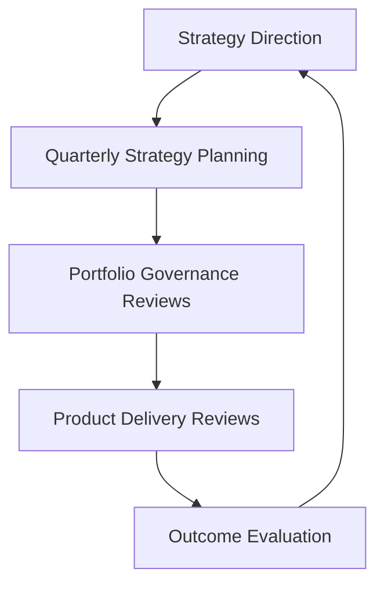
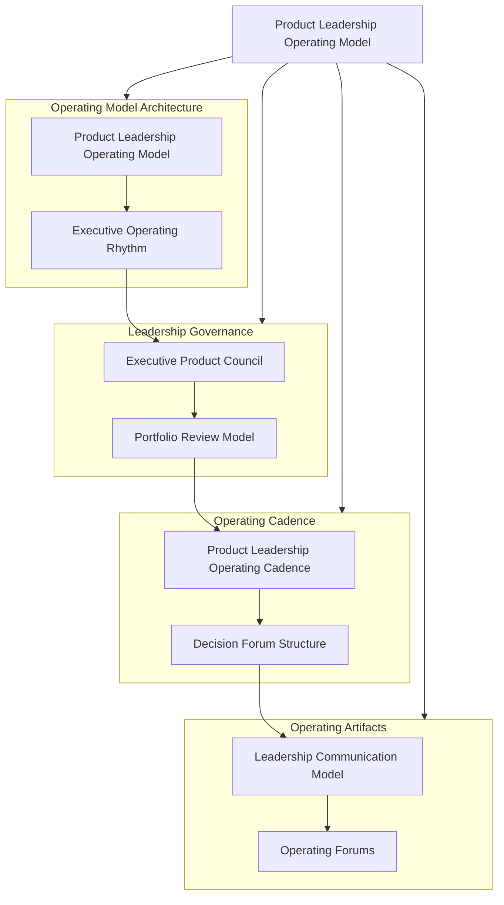

This repository documents the **Product Leadership Operating Model (PLOM)** — the leadership cadence, governance forums, and decision rhythms used to operate the **Product Leadership Systems Architecture (PLSA)**.

The operating model defines **how leadership teams run the architecture** through structured planning cycles, portfolio governance, delivery coordination, and outcome evaluation.

---

# Product Leadership Operating Model

The diagram below illustrates the **leadership operating cycle** used to run modern product organizations.

The operating model coordinates strategy, governance, execution, and outcome evaluation through a structured leadership rhythm.

---

# Operating Model Overview

The **Product Leadership Operating Model** defines the leadership mechanisms used to coordinate strategy, governance, delivery, and outcome evaluation across modern product organizations.

Where the **Product Leadership Systems Architecture (PLSA)** defines the structural model of the product leadership system, the operating model defines the **cadence, forums, and decision rhythms** used to run that system.

The operating model establishes:

- leadership decision forums
- strategic planning cycles
- portfolio governance reviews
- delivery coordination mechanisms
- outcome evaluation processes

These operating mechanisms ensure that strategic direction is translated into governed investments, coordinated execution, measurable outcomes, and continuous learning.

---

# 10-Second Overview

This repository explains how leadership teams operate the product organization through a structured leadership rhythm:

- strategy defines organizational priorities and investment themes
- governance converts strategy into portfolio decisions
- delivery coordinates execution across product and engineering
- outcomes evaluate customer impact and value realization
- leadership learning informs future strategy

The operating model ensures that these systems work together through structured forums, decision cadences, and operating routines.

---

# Operating Model Structure

The Product Leadership Operating Model organizes leadership work through four primary operating mechanisms.

| Operating Mechanism | Purpose |
|---|---|
| Strategic Planning | Align leadership around strategic direction and investment themes |
| Portfolio Governance | Evaluate initiatives, prioritize investments, and manage tradeoffs |
| Delivery Coordination | Monitor execution progress and resolve cross-functional dependencies |
| Outcome Evaluation | Assess whether delivered capabilities created meaningful customer value |

Together these mechanisms define the leadership rhythm used to run the product organization.

---

# Architecture Knowledge Map

--

# Core Operating Model Artifacts

This repository contains a set of artifacts that describe how leadership teams operate the product organization through structured governance, cadence, and coordination mechanisms.

These artifacts define the operating rhythm that connects strategic direction, portfolio governance, delivery coordination, and outcome evaluation.

### Architecture

- **Product Leadership Operating Model**  
  Defines the canonical operating model used to coordinate strategy, governance, delivery, and outcomes.

- **Executive Operating Rhythm**  
  Describes the leadership planning cycles and governance rhythms used to run the organization.

### Governance

- **Executive Product Council Model**  
  Defines the leadership forum responsible for strategic alignment and portfolio decision-making.

- **Portfolio Review Model**  
  Describes how leadership teams review portfolio performance, investment decisions, and delivery progress.

### Cadence

- **Product Leadership Operating Cadence**  
  Defines the structured leadership rhythm that connects strategy planning, governance reviews, delivery coordination, and outcome evaluation.

- **Decision Forum Structure**  
  Explains the hierarchy of leadership decision forums used to govern strategy, investments, and execution.

### Operating Artifacts

- **Leadership Communication Model**  
  Describes how strategic direction, portfolio decisions, and delivery priorities are communicated across the organization.

- **Operating Forums**  
  Defines the recurring leadership meetings that coordinate strategy execution, portfolio governance, and delivery oversight.

Together these artifacts define how leadership teams operate the product organization through a coherent and repeatable governance rhythm.

---

# Repository Structure

This repository functions as an **operating model documentation library** for the Product Leadership Operating Model.

Artifacts are organized into the following directories.

| Directory | Purpose |
|---|---|
| `architecture/` | Canonical operating model definitions and leadership system descriptions |
| `frameworks/` | Leadership governance frameworks and operating cadence models |
| `artifacts/` | Decision forums, leadership coordination mechanisms, and supporting operating structures |
| `diagrams/` | Reusable operating model diagrams used across documentation |

This structure keeps the repository navigable while separating core architecture models, governance frameworks, operating artifacts, and visual documentation.

---

# Relationship to the Product Leadership Systems Architecture

The **Product Leadership Operating Model** complements the **Product Leadership Systems Architecture (PLSA)**.

The Product Leadership Systems Architecture defines the **structural design of the leadership system** that connects strategy, governance, delivery, customer outcomes, and decision intelligence.

The Product Leadership Operating Model defines **how leadership teams operate that system through structured governance forums, decision cycles, and leadership cadences**.

In simple terms:

- **Architecture** defines the leadership system.
- **Operating Model** defines how leaders run that system.

The two repositories should therefore be viewed together:

- the architecture repository explains the structure of the leadership system
- the operating model repository explains the governance mechanisms used to operate it

---

# Documentation Standard

All repositories in this portfolio follow a consistent documentation standard.

Key principles include:

- executive-level tone that reflects leadership operating models
- architecture-first framing that emphasizes systems, interfaces, and governance mechanisms
- GitHub-compatible Mermaid diagrams used for visual architecture explanations
- consistent terminology across repositories to preserve architectural integrity
- documentation structure similar to internal operating architecture libraries used by large technology organizations

This repository is intentionally **not**:

- a coding tutorial
- a software development framework
- a product management handbook
- academic research

It is an **operating model architecture library for product leadership systems**.

---

# License

This repository is released under the **MIT License**.

The MIT License permits reuse, modification, and distribution of this material provided that the original copyright and license notice are included.

See the full license text in the repository:

[MIT License](LICENSE)

