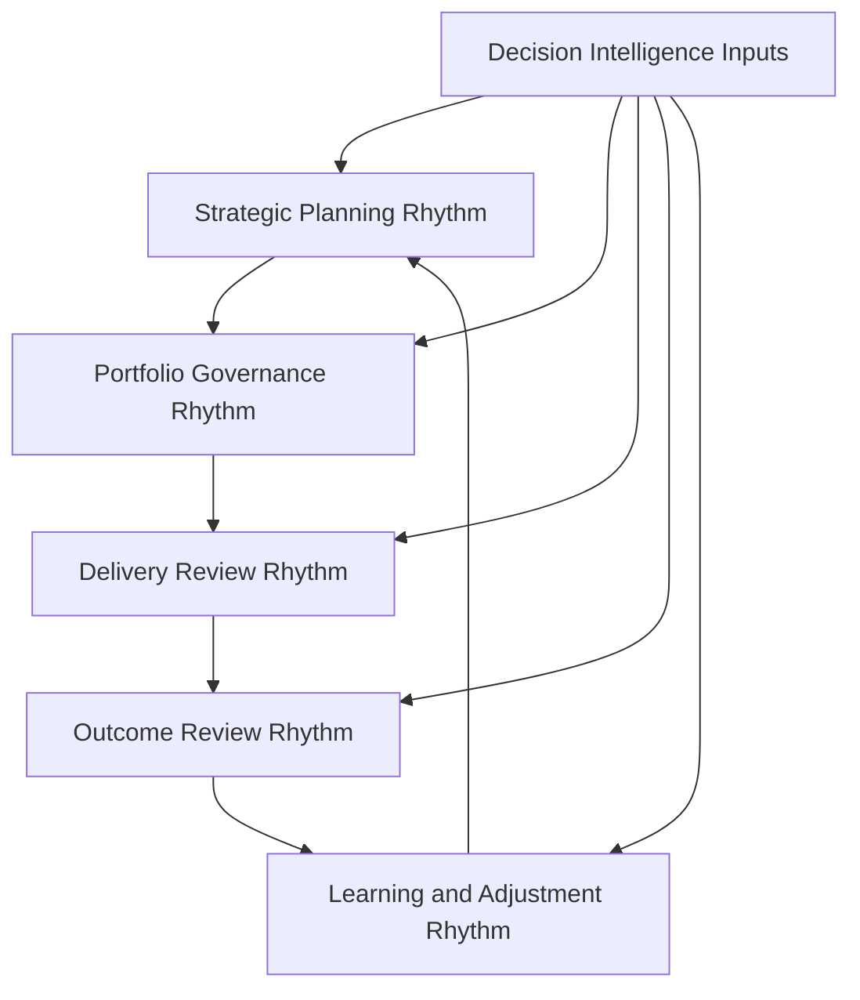
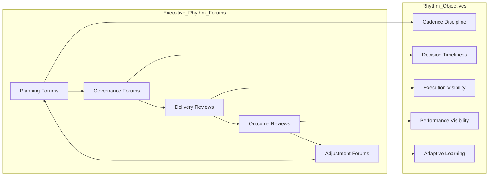

# Executive Operating Rhythm

The **Executive Operating Rhythm** defines the recurring leadership cadence used to run the **Product Leadership Operating Model** across strategy, governance, delivery, outcomes, and learning.

Where the **Product Leadership Operating Model** defines the canonical operating logic for how leadership teams run the **Product Leadership Operating System (PLOS)**, this artifact defines the **recurring rhythm of executive reviews, governance moments, escalation paths, and adjustment cycles** used to sustain that operating model over time.

It explains how leadership activity is structured as a disciplined rhythm rather than a collection of disconnected meetings.

---

## Purpose

The purpose of this artifact is to define the **recurring executive rhythm** used to operate the Product Leadership Operating System.

This artifact clarifies how leadership teams:

- establish a repeatable cadence for strategy, governance, delivery, and outcome review
- connect executive forums into one operating rhythm rather than isolated events
- create predictable review moments for decision-making, escalation, adjustment, and alignment
- maintain leadership visibility across portfolio investments and execution health
- reinforce learning and strategic adjustment through recurring operating cycles

This artifact does **not** redefine the canonical architecture or replace the Product Leadership Operating Model.

Instead, it explains the cadence structure through which the operating model is sustained in practice.

---

## Diagram

---

## Diagram Interpretation

This diagram shows the recurring executive rhythm used to sustain the Product Leadership Operating Model over time.

The stages shown here are **rhythm constructs**, not replacement names for the canonical systems. They explain how executive activity is sequenced across recurring planning, governance, review, and learning cycles so that the broader operating model remains disciplined and predictable.

The rhythm begins with **Strategic Planning Rhythm**, where leadership establishes planning intent, strategic priorities, portfolio themes, and directional constraints for the next cycle.

Those signals move into **Portfolio Governance Rhythm**, where leadership evaluates proposals, governs investment tradeoffs, approves or defers work, and aligns portfolio choices to strategic direction.

Approved commitments then enter **Delivery Review Rhythm**, where leadership monitors progress, reviews risks, resolves escalations, and maintains confidence in execution against portfolio expectations.

From there, leadership enters **Outcome Review Rhythm**, where delivered work is evaluated against customer, business, operational, and strategic performance signals.

Those findings then inform **Learning and Adjustment Rhythm**, where leadership updates assumptions, refines priorities, strengthens control mechanisms, and shapes the next cycle of strategic planning.

**Decision Intelligence Inputs** support each stage by supplying evidence, telemetry, trends, and insight needed to run the rhythm with discipline.

---

## Operating Logic

The Executive Operating Rhythm functions as the cadence layer of the Product Leadership Operating Model.

Its operating logic is based on five rhythm responsibilities:

### 1. Planning Rhythm

Leadership establishes recurring planning intervals that convert strategic intent into operating direction, review priorities, and executive focus areas.

This ensures strategy is refreshed through cadence rather than treated as a one-time declaration.

### 2. Governance Rhythm

Leadership creates recurring governance intervals for portfolio evaluation, prioritization, funding, sequencing, and tradeoff decisions.

This ensures investment decisions happen through structured rhythm rather than ad hoc intervention.

### 3. Review Rhythm

Leadership maintains predictable delivery review intervals to monitor execution health, resolve escalations, review dependencies, and maintain delivery confidence.

This ensures leadership oversight is continuous and governable without becoming operational micromanagement.

### 4. Performance Rhythm

Leadership establishes recurring outcome reviews to assess value realization, business impact, customer results, and operating performance.

This ensures performance evaluation is embedded in the operating model rather than treated as an afterthought.

### 5. Adjustment Rhythm

Leadership uses recurring adjustment moments to refine direction, rebalance commitments, improve forum effectiveness, and strengthen the next cycle.

This ensures the operating rhythm remains adaptive and connected to learning.

These rhythm responsibilities map across the broader leadership loop: planning reinforces strategy, governance structures investment decisions, review supports delivery oversight, performance evaluates outcomes, and adjustment closes the learning loop back into the next planning cycle.

Together, these responsibilities form the recurring rhythm that keeps the operating model active, visible, and sustainable over time.

---

## Supporting Diagram

---

## Why This Matters

A strong operating model is not sustained by structure alone.

It depends on a disciplined executive rhythm that makes planning, governance, review, and adjustment repeatable over time.

Without an explicit executive operating rhythm:

- leadership forums can become disconnected events
- governance can become inconsistent or delayed
- delivery reviews can become reactive
- outcome evaluation can become sporadic
- learning can fail to influence the next cycle
- executive teams can lose operating coherence even when the model itself is well designed

This artifact matters because it makes the cadence logic of the operating model explicit.

It defines how leadership maintains momentum, predictability, visibility, and adaptive control across the Product Leadership Operating System.

---

## How To Use This

This artifact should be used as the reference for designing and evaluating the recurring cadence used to run the Product Leadership Operating Model.

Use it to:

- define the executive review rhythm across strategy, governance, delivery, outcomes, and adjustment
- align leadership forums into one coherent cadence
- identify where escalation, decision, and adjustment moments should recur
- assess whether current review structures operate as an integrated rhythm
- strengthen the repeatability of executive oversight without creating unnecessary ceremony
- align supporting cadence and forum artifacts to one rhythm model

This artifact is especially useful when:

- designing an executive operating cadence
- restructuring leadership review forums
- diagnosing fragmented operating rhythms
- improving predictability in governance and delivery oversight
- strengthening feedback loops between outcomes and strategic adjustment
- aligning multiple leadership forums into one operating sequence

---

## Relationship to the Operating System

This artifact is part of the **Product Leadership Operating System (PLOS)** and is a **canonical supporting artifact for Pillar 2: Product Leadership Operating Model**.

Its role is specific:

- **PLOS** is the overall portfolio and leadership operating system
- **PLSA** is the canonical systems architecture defined in Pillar 1
- the **Product Leadership Operating Model** is the canonical Pillar 2 source artifact defining how the architecture is run
- the **Executive Operating Rhythm** defines the recurring cadence used to sustain that operating model in practice

This artifact supports the operating model without replacing it and reinforces the recurring leadership rhythm across strategy, governance, delivery, outcomes, and learning.

It should remain aligned to:

- **Unified Product Leadership Systems Architecture**
- **Product Leadership Systems Architecture Metamodel**
- **Product Leadership Operating Model**

It also supports downstream artifacts related to:

- decision forum structure
- operating forums
- leadership communication
- portfolio review cadence
- product leadership operating cadence diagrams
- escalation and adjustment mechanisms

---

## Summary

The **Executive Operating Rhythm** defines the recurring cadence through which leadership teams sustain the Product Leadership Operating Model over time.

It explains how planning, governance, delivery review, outcome evaluation, and adjustment are connected into one repeatable executive rhythm.

This artifact is not the canonical operating model itself.

It is a **supporting Pillar 2 review structure artifact** that explains how the operating model is maintained through disciplined leadership cadence across the broader operating loop.

---

## License

This project is licensed under the MIT License - see the [LICENSE](../LICENSE) file for details.

