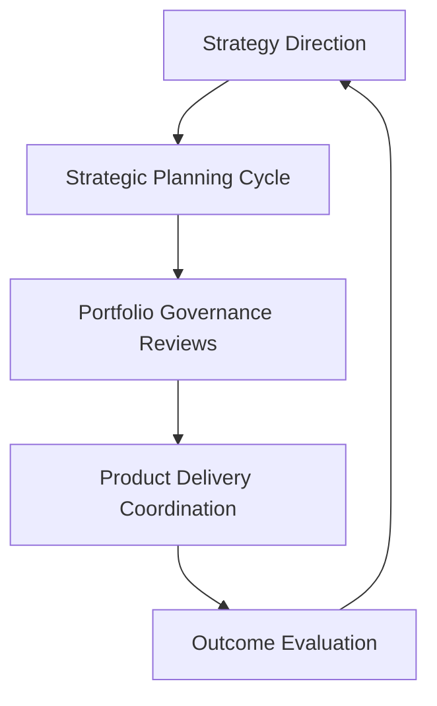
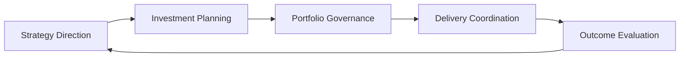

# Product Leadership Operating Model

The **Product Leadership Operating Model (PLOM)** defines how leadership teams coordinate strategy, governance, product delivery, and outcome evaluation across modern product organizations.

Where the **Product Leadership Systems Architecture (PLSA)** defines the structural design of the product leadership system, the operating model defines the **cadence, governance forums, and leadership rhythms used to run that system**.

Together, the architecture and operating model form the **Product Leadership Operating System**.

---

# Purpose

The purpose of this artifact is to provide the **canonical operating model** for the Product Leadership Systems Architecture.

While the architecture repository explains the structure of the leadership system, this document explains **how leadership teams operate that system through structured decision forums and governance cycles**.

The operating model clarifies:

- how strategy planning is coordinated
- how portfolio governance decisions are made
- how delivery execution is monitored
- how outcomes are evaluated
- how leadership learning informs future strategy

This document therefore defines the **operational rhythm of the product leadership system**.

---

# Diagram

The diagram below illustrates the leadership operating cycle used to coordinate strategic direction, portfolio governance, delivery execution, and outcome evaluation.

---

# Diagram Interpretation

The Product Leadership Operating Model organizes leadership coordination through a structured operating cycle.

### Strategy Direction

Leadership establishes strategic priorities, investment themes, and enterprise objectives that guide product direction.

This strategic direction establishes the foundation for portfolio governance and execution planning.

### Strategic Planning Cycle

Strategic planning translates leadership priorities into potential initiatives and investment themes.

Planning activities typically occur on an annual or quarterly cadence and align cross-functional leadership teams around shared objectives.

### Portfolio Governance Reviews

Portfolio governance forums evaluate candidate initiatives, prioritize investments, allocate resources, and manage portfolio risk.

These governance reviews ensure that initiatives entering execution align with strategic direction and organizational capacity.

### Product Delivery Coordination

Delivery coordination mechanisms ensure that product, engineering, and cross-functional teams execute approved initiatives effectively.

Leadership reviews monitor delivery progress, resolve dependencies, and ensure execution remains aligned with portfolio priorities.

### Outcome Evaluation

Outcome evaluation assesses whether delivered capabilities generated meaningful customer value.

Adoption signals, usage patterns, customer feedback, and value realization indicators inform leadership understanding of whether investments achieved their intended impact.

Outcome insights then inform future strategic direction, completing the leadership operating cycle.

---

# Operating Logic

The Product Leadership Operating Model functions as a leadership coordination system.

The operating logic begins with **strategic direction**, where leadership establishes enterprise priorities and investment themes.

These priorities are translated into potential initiatives through **strategic planning cycles**, which align leadership teams around shared goals.

Candidate initiatives move into **portfolio governance reviews**, where leadership evaluates opportunities, prioritizes investments, and allocates resources.

Approved initiatives enter the **product delivery system**, where product and engineering teams coordinate execution through roadmaps, releases, and delivery coordination mechanisms.

Following delivery, the **customer outcomes system** evaluates whether capabilities generated meaningful value through adoption and impact measurement.

Insights generated from outcomes and execution then inform future strategic planning, enabling leadership teams to refine direction and improve decision-making.

This creates a continuous operating cycle that connects strategy, governance, execution, and learning.

---

# Supporting Diagram

---

# Why This Matters

Many organizations struggle to translate strategic direction into coordinated execution.

Common failure patterns include:

- strategy that does not translate into explicit investment decisions
- governance processes disconnected from delivery realities
- delivery teams operating independently of strategic priorities
- outcome signals that fail to influence future decisions

The Product Leadership Operating Model addresses these challenges by defining a **structured leadership rhythm** that connects strategic direction, governance, execution, and outcome evaluation.

By making these leadership mechanisms explicit, organizations improve alignment, decision clarity, and operational scalability.

---

# How To Use This

This artifact can be used by leadership teams to design or evaluate their product operating model.

It is especially useful when:

- establishing leadership governance forums
- aligning strategy planning with portfolio decisions
- coordinating product and engineering execution
- improving outcome measurement and learning loops

Organizations can use this model to assess whether their leadership processes effectively connect strategic priorities, investment decisions, execution coordination, and outcome evaluation.

---

# Relationship to the Product Leadership Systems Architecture

The Product Leadership Operating Model complements the **Product Leadership Systems Architecture (PLSA)**.

The architecture defines the **structural design of the leadership system**, including the systems responsible for strategy execution, portfolio governance, delivery coordination, customer outcomes, and decision intelligence.

The operating model defines **how leadership teams operate those systems through governance forums, decision cycles, and leadership cadences**.

In simple terms:

Architecture defines the leadership system.  
Operating Model defines how leaders run that system.

Together, the architecture and operating model form the foundation of the **Product Leadership Operating System**.

---

# Summary

The Product Leadership Operating Model defines how leadership teams coordinate strategy, governance, delivery, and outcome evaluation across modern product organizations.

By establishing structured governance forums, leadership cadences, and decision cycles, the operating model ensures that strategic priorities translate into governed investments, coordinated execution, measurable outcomes, and continuous learning.

This artifact serves as the canonical reference for understanding how leadership teams operate the Product Leadership Systems Architecture.

---

# License

This repository is released under the **MIT License**.

See the full license text in the repository:

[MIT License](../LICENSE)
