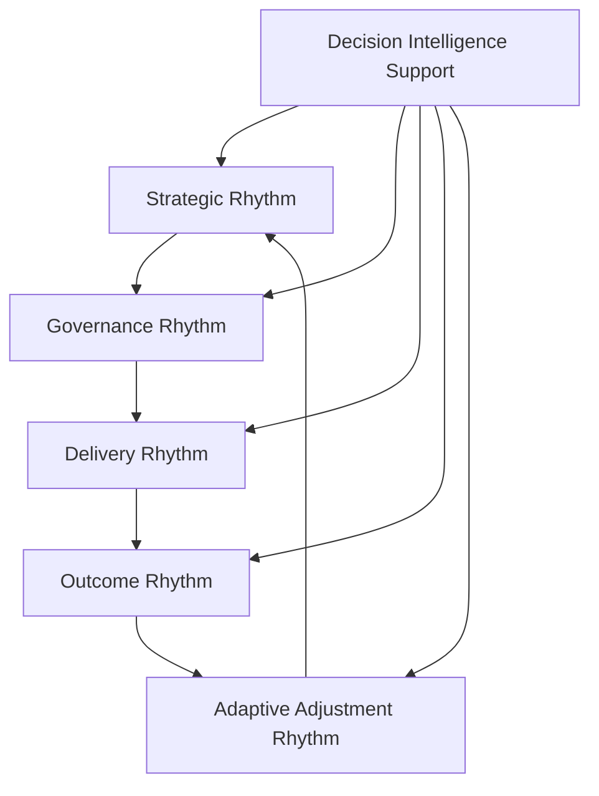
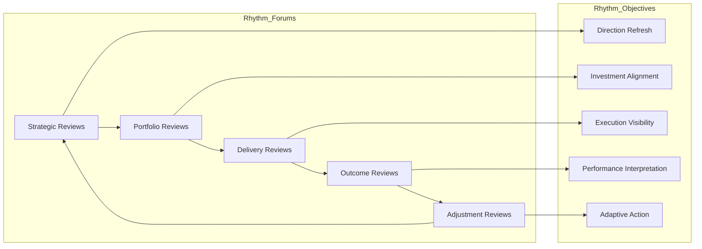

# Executive Operating Rhythm Architecture

The **Executive Operating Rhythm Architecture** defines the recurring leadership cadence used to run the **Product Leadership Operating Model** across the **Product Leadership Operating System (PLOS)**.

Where the **Product Leadership Systems Architecture (PLSA)** defines the canonical five-system structure of the operating system, and the **Product Leadership Operating Model** defines the leadership mechanisms used to run that architecture, this artifact defines the **recurring executive review rhythm through which those mechanisms are sustained in practice**.

It explains how leadership teams sequence strategic reviews, governance reviews, delivery reviews, outcome reviews, and adaptive adjustment across a disciplined recurring cadence rather than through disconnected meetings or reactive escalation.

---

## Purpose

The purpose of this artifact is to define the **executive operating rhythm** used to sustain the Product Leadership Operating System over time.

This artifact clarifies how leadership teams:

- establish a recurring cadence for strategic, governance, delivery, and outcome review
- connect decision forums into an integrated operating rhythm
- sequence review activity across the broader leadership loop
- create predictable timing for escalation, intervention, and adjustment
- reinforce executive discipline, visibility, and adaptability across the operating model

This artifact does **not** redefine the canonical systems architecture or replace the Product Leadership Operating Model.

Instead, it defines the recurring review rhythm through which leadership operates the model in practice across the canonical five-system architecture.

---

## Diagram

---

## Diagram Interpretation

This diagram shows the recurring executive operating rhythm used to run the Product Leadership Operating Model.

The stages shown here are **rhythm constructs** used to explain how leadership cadence is organized across the operating model. They are not replacement names for the canonical systems defined in the Product Leadership Systems Architecture. Instead, they show how executive review and operating cadence move across strategy, governance, delivery, outcomes, and learning as part of a recurring leadership loop.

The rhythm begins with **Strategic Rhythm**, where leadership reaffirms enterprise direction, reviews strategic priorities, evaluates changing constraints, and refreshes the intent that shapes downstream portfolio and operating decisions.

Those signals move into **Governance Rhythm**, where leadership evaluates investment choices, reviews prioritization, manages resource allocation, and governs portfolio tradeoffs through recurring executive review.

Approved priorities then move into **Delivery Rhythm**, where leadership monitors progress, reviews risks, addresses dependencies, resolves escalations, and maintains execution confidence through a structured cadence of oversight.

From there, leadership enters **Outcome Rhythm**, where delivered work is evaluated against customer outcomes, business performance, operating measures, and strategic intent through recurring review forums.

Those findings then inform **Adaptive Adjustment Rhythm**, where leadership translates review findings, escalation signals, and learning into corrective action, portfolio rebalancing, operating changes, or strategic refinement before the next cycle begins.

**Decision Intelligence Support** informs every stage by supplying telemetry, evidence, performance signals, and analysis needed to improve review quality, timing, and decision effectiveness.

---

## Operating Logic

The Executive Operating Rhythm Architecture functions as the recurring cadence layer of the Product Leadership Operating Model.

Its operating logic is based on five rhythm responsibilities:

### 1. Strategic Rhythm Responsibility

Leadership maintains a recurring rhythm for reviewing strategic direction, enterprise priorities, market or mission shifts, and value expectations.

This rhythm ensures that the operating system remains anchored to evolving enterprise intent rather than running on stale assumptions.

### 2. Governance Rhythm Responsibility

Leadership maintains a recurring rhythm for portfolio review, prioritization, investment governance, resource allocation, and tradeoff management.

This rhythm ensures that strategic intent is regularly converted into governed portfolio action through an explicit review cadence.

### 3. Delivery Rhythm Responsibility

Leadership maintains a recurring rhythm for reviewing execution progress, delivery risks, dependencies, escalation signals, and operating constraints.

This rhythm ensures that execution remains visible, governable, and aligned to leadership intent over time.

### 4. Outcome Rhythm Responsibility

Leadership maintains a recurring rhythm for reviewing customer results, business performance, operational effects, and realized value.

This rhythm ensures that delivered work is regularly interpreted through evidence rather than assumed to be successful once shipped.

### 5. Adaptive Rhythm Responsibility

Leadership maintains a recurring rhythm for translating review findings into correction, rebalancing, structural improvement, or strategic refinement.

This rhythm ensures that the operating model remains adaptive and that learning is converted into executive action rather than left as passive observation.

These responsibilities map across the broader leadership loop: strategy reviews refresh direction, governance reviews allocate and authorize, delivery reviews sustain execution, outcome reviews interpret results, and adaptive reviews drive refinement into the next cycle.

Together, these responsibilities form the recurring executive operating rhythm that keeps the Product Leadership Operating System governed, visible, and responsive over time.

---

## Supporting Diagram

---

## Why This Matters

An operating model requires more than defined roles, governance structures, and decision forums.

It also requires a recurring rhythm that determines **when** leadership reviews happen, **how** signals move through the system, and **how often** adjustment occurs.

Without an explicit executive operating rhythm:

- strategic review can become episodic instead of integrated
- governance activity can become reactive instead of scheduled
- delivery oversight can lose cadence and comparability
- outcome review can drift away from delivery and governance timing
- adaptation can become delayed, inconsistent, or informal
- leadership teams can operate with activity but without synchronized control

This artifact matters because it makes the timing structure of the operating model explicit.

It defines the recurring leadership rhythm that connects strategy, governance, delivery, outcomes, and adjustment into a disciplined executive operating loop.

---

## How To Use This

This artifact should be used as the reference for designing, evaluating, and refining the recurring leadership cadence used to run the Product Leadership Operating Model.

Use it to:

- define the major executive review rhythms across the leadership loop
- align strategic, governance, delivery, and outcome review timing
- create predictable cadence for escalation and adjustment
- connect decision forums into one operating rhythm
- evaluate whether review activity is sequenced as a coherent system rather than as isolated forums
- strengthen leadership visibility and adaptability through recurring review structure

This artifact is especially useful when:

- standing up a new operating model
- redesigning executive review cadence
- reducing fragmentation across leadership meetings
- aligning portfolio and delivery review timing
- improving the flow from outcome review to strategic adjustment
- strengthening executive control across the operating system

---

## Relationship to the Operating System

This artifact is part of the **Product Leadership Operating System (PLOS)** and is a **canonical supporting artifact for Pillar 2: Product Leadership Operating Model**.

Its role is specific:

- **PLOS** is the overall portfolio and leadership operating system
- **PLSA** is the canonical systems architecture defined in Pillar 1
- the **Product Leadership Operating Model** is the canonical Pillar 2 source artifact defining how the architecture is run
- the **Executive Operating Rhythm Architecture** defines the recurring leadership cadence used to sustain that model over time
- the **Executive Control Architecture** defines the control structures and intervention pathways used to govern that cadence
- the **Decision Forum Structure** defines where and how leadership decisions are made within that recurring rhythm

This artifact supports the operating model without replacing it and reinforces disciplined cadence across strategy, governance, delivery, outcomes, and learning.

It should remain aligned to:

- **Unified Product Leadership Systems Architecture**
- **Product Leadership Systems Architecture Metamodel**
- **Product Leadership Operating Model**
- **Executive Control Architecture**
- **Decision Forum Structure**

It also supports downstream artifacts related to:

- review calendars
- governance cadence structures
- leadership forum sequencing
- escalation timing models
- executive communication patterns
- operating review design across portfolio, delivery, and outcomes

---

## Summary

The **Executive Operating Rhythm Architecture** defines the recurring leadership cadence used to sustain the Product Leadership Operating Model across the Product Leadership Operating System.

It explains how strategic, governance, delivery, outcome, and adaptive adjustment reviews are sequenced into a disciplined executive rhythm rather than left to disconnected meetings or reactive escalation.

This artifact is not the canonical operating model itself.

It is a **canonical supporting Pillar 2 review structure artifact** that explains how leadership review cadence is organized across the broader leadership operating loop.

---

## License

This project is licensed under the MIT License - see the [LICENSE](../LICENSE) file for details.
