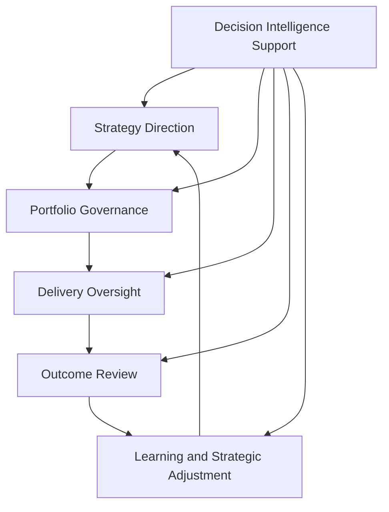
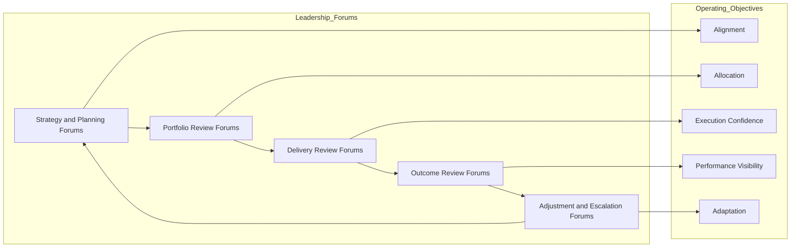

# Product Leadership Operating Model

The **Product Leadership Operating Model** defines the leadership cadence, governance rhythms, executive forums, review structures, and operating mechanisms used to run the **Product Leadership Operating System (PLOS)**.

Where the **Product Leadership Systems Architecture (PLSA)** defines the canonical structure of the five core systems, the operating model defines **how leadership teams operate that architecture in practice** through recurring control mechanisms, decision cycles, portfolio reviews, delivery oversight, outcome evaluation, and strategic adjustment.

It explains how product leadership turns the canonical architecture into a disciplined executive operating system.

---

## Purpose

The purpose of this artifact is to define the **canonical operating model** for the Product Leadership Operating System.

This artifact clarifies how leadership teams:

- translate strategic intent into operating direction
- govern portfolio investments through executive review
- oversee execution through recurring delivery mechanisms
- evaluate customer and business outcomes through structured review
- use learning signals to refine strategy, priorities, and operating behavior
- maintain alignment across governance, delivery, and outcomes over time

This artifact does **not** redefine the canonical architecture systems.

Instead, it defines the operating cadence, forums, review structures, and executive control mechanisms used to run the canonical five-system architecture established in Pillar 1.

---

## Diagram

---

## Diagram Interpretation

This diagram shows the leadership operating cycle used to run the Product Leadership Operating System.

The stages shown here are **operating-model constructs** used to explain the leadership cadence across the canonical architecture. They do not replace the five canonical systems defined in the Product Leadership Systems Architecture. Instead, they describe how leadership teams move through recurring strategic, governance, delivery, outcome, and learning activities in order to operate that architecture coherently.

The cycle begins with **Strategy Direction**, where leadership establishes enterprise priorities, strategic intent, investment themes, performance expectations, and operating constraints.

Those strategic signals move into **Portfolio Governance**, where leaders evaluate proposals, approve investments, sequence priorities, allocate resources, and govern tradeoffs across the product portfolio.

Approved work then moves into **Delivery Oversight**, where leadership monitors execution health, resolves escalations, reviews progress, manages dependencies, and maintains alignment between delivery activity and portfolio commitments.

From there, leadership enters **Outcome Review**, where delivered work is evaluated against customer value, business impact, operational performance, and strategic objectives.

Those findings then inform **Learning and Strategic Adjustment**, where leadership refines direction, updates assumptions, rebalances investments, and improves the next operating cycle.

**Decision Intelligence Support** informs each stage by providing telemetry, evidence, metrics, analysis, and decision support needed to run the model with discipline.

---

## Operating Logic

The Product Leadership Operating Model functions as the recurring executive mechanism that turns architecture into coordinated leadership action.

Its operating logic is based on five linked responsibilities:

### 1. Strategic Direction

Leadership establishes strategic priorities, operating intent, investment boundaries, and expected outcomes.

This ensures that governance and execution remain anchored to enterprise strategy rather than fragmented local decisions.

### 2. Governance and Allocation

Leadership uses structured governance mechanisms to approve, defer, sequence, fund, or stop work across the portfolio.

This converts strategic direction into governed investment action.

### 3. Execution Oversight

Leadership monitors delivery through recurring operating reviews, dependency visibility, escalation channels, and progress assessment.

This keeps execution transparent, aligned, and governable without collapsing executive leadership into day-to-day delivery management.

### 4. Performance Review

Leadership evaluates whether delivered work is creating intended value across customer, business, portfolio, and operational dimensions.

This prevents output completion from being mistaken for strategic success.

### 5. Learning and Adjustment

Leadership uses review signals, evidence, and operating feedback to refine strategy, rebalance priorities, strengthen control mechanisms, and improve future decisions.

This closes the operating loop and ensures that the model remains adaptive over time.

These responsibilities map directly to the broader leadership loop: strategic direction informs governance, governance directs delivery, delivery produces outcomes, outcome review drives learning, and learning feeds the next cycle of strategic direction.

Together, these responsibilities form the core operating logic of the Product Leadership Operating Model.

---

## Supporting Diagram

---

## Why This Matters

Modern product organizations do not operate effectively through strategy documents alone or through delivery motion alone.

They require a disciplined operating model that explains how leadership teams repeatedly connect direction, governance, execution, outcomes, and learning.

Without a clear operating model:

- strategic priorities can fail to influence actual investment decisions
- governance can become episodic or inconsistent
- delivery oversight can become reactive rather than structured
- outcome reviews can become disconnected from decision-making
- learning can remain implicit rather than operationalized
- executive leadership can lose operating coherence across the portfolio

This artifact matters because it makes the leadership operating system explicit.

It defines the recurring mechanisms through which product leadership governs the portfolio, oversees delivery, evaluates performance, and adapts over time.

---

## How To Use This

This artifact should be used as the canonical reference for how the Product Leadership Operating System is run.

Use it to:

- design executive operating cadence
- align governance, review, and escalation structures
- clarify how strategy is translated into portfolio decisions
- connect delivery oversight to executive leadership mechanisms
- define outcome review structures that drive adjustment
- evaluate whether operating forums function as control mechanisms rather than reporting ceremonies
- align supporting Pillar 2 artifacts to one coherent operating model

This artifact is especially useful when:

- standing up a product leadership operating system
- redesigning executive governance rhythms
- clarifying leadership decision pathways
- improving strategy-to-execution control
- strengthening cross-functional operating alignment
- assessing whether existing forums and reviews are working as an integrated model

---

## Relationship to the Operating System

This artifact is part of the **Product Leadership Operating System (PLOS)** and is the **canonical source artifact for Pillar 2: Product Leadership Operating Model**.

Its role is specific:

- **PLOS** is the overall portfolio and leadership operating system
- **PLSA** is the canonical systems architecture defined in Pillar 1
- the **Product Leadership Operating Model** defines the cadence, governance rhythms, executive forums, and operating mechanisms used to run that architecture
- supporting Pillar 2 artifacts, including control models, operating rhythm artifacts, forum structures, cadence diagrams, and review models, must align to this operating model

This artifact therefore sits below the canonical architecture artifacts in Pillar 1 and above supporting Pillar 2 artifacts that operationalize specific elements of cadence, governance, forums, communication, and review.

It should remain aligned to:

- **Unified Product Leadership Systems Architecture**
- **Product Leadership Systems Architecture Metamodel**

It governs alignment for supporting Pillar 2 artifacts such as:

- **Executive Control Architecture**
- **Executive Operating Rhythm**
- **Decision Forum Structure**
- **Leadership Communication Model**
- **Operating Forums**
- **Executive Product Council Model**
- **Portfolio Review Model**
- **Product Leadership Operating Cadence**
- Pillar 2 supporting diagrams

---

## Summary

The **Product Leadership Operating Model** defines how leadership teams run the Product Leadership Operating System through recurring strategy direction, portfolio governance, delivery oversight, outcome review, and adaptive adjustment.

It provides the canonical operating logic that connects executive cadence, decision forums, review structures, and leadership control mechanisms across the broader leadership loop.

This artifact is not the canonical systems architecture itself.

It is the **canonical Pillar 2 operating model** that explains how the established architecture is operated in practice across governance, delivery, outcomes, and learning.

---

## License

This project is licensed under the MIT License - see the [LICENSE](../LICENSE) file for details.

